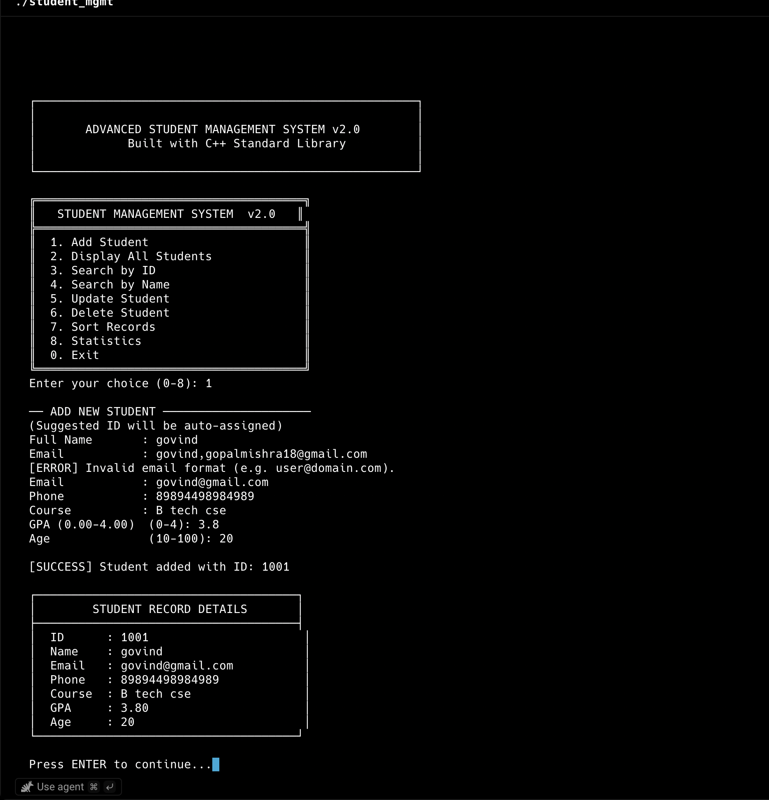

# 🎓 Advanced Student Management System

> A fully-featured, file-persistent, CLI-based Student Management System built in modern C++17.  
> Portfolio-quality code demonstrating OOP, file I/O, input validation, sorting algorithms, and clean modular architecture.

---

## 📸 Preview


---

## 📋 Description

This application allows educational institutions or developers to manage student records through an interactive menu-driven terminal interface. Records are persisted to a CSV file so data survives between sessions. The codebase demonstrates professional C++ practices: separation of concerns, class encapsulation, regex-based validation, STL algorithms, and robust error handling.

---

## ✨ Features

| Feature | Details |
|---|---|
| **Add Student** | Auto-incremented ID, validated name/email/phone/GPA/age |
| **Display All** | Formatted tabular view with column-aligned output |
| **Search by ID** | O(n) linear scan returning a detailed card |
| **Search by Name** | Case-insensitive substring match, returns multiple results |
| **Update Student** | Field-by-field editing, press Enter to keep existing value |
| **Delete Student** | Confirmation prompt before irreversible removal |
| **Sort Records** | Sort by ID / Name / GPA, ascending or descending |
| **Statistics** | Average/min/max GPA & age, GPA distribution buckets |
| **Persistent Storage** | Auto-loads and saves to `students.csv` on every change |
| **Input Validation** | Email regex, phone format, GPA range, age range, name chars |
| **Error Handling** | Graceful messages for all invalid inputs and edge cases |

---

## 🛠 Tech Stack

- **Language**: C++17
- **Libraries**: STL (`<vector>`, `<algorithm>`, `<fstream>`, `<regex>`, `<iomanip>`)
- **Build Tool**: GNU Make / g++
- **Storage**: CSV flat file (`students.csv`)

---

## 📁 Project Structure

```
student_management_system/
├── main.cpp          # Entry point – wires manager + UI together
├── student.h         # Student struct + StudentManager class declaration
├── student.cpp       # Full CRUD, file I/O, sorting, validation logic
├── ui.h              # UI class declaration (menu-driven interface)
├── ui.cpp            # Console UI: menus, input collection, display
├── Makefile          # Build configuration
├── students.csv      # Auto-generated data file (created at first run)
├── screenshot.png    # Application screenshot
└── README.md         # This file
```

---

## 🚀 How to Run

### Prerequisites
- g++ with C++17 support (`g++ --version` should be ≥ 7.0)
- GNU Make

### Build & Run

```bash
# Clone or download the project
cd student_management_system

# Build
make

# Run
./student_mgmt

# Or build and run in one step
make run

# Clean build artifacts
make clean

# Remove saved data as well
make clean-all
```

### Windows (MinGW)

```cmd
g++ -std=c++17 -Wall -O2 -o student_mgmt.exe main.cpp student.cpp ui.cpp
student_mgmt.exe
```

---

## 📊 Data Format (students.csv)

```csv
id,name,email,phone,course,gpa,age
1001,Alice Johnson,alice@example.com,9876543210,Computer Science,3.85,20
1002,Bob Smith,bob@example.com,9123456780,Mathematics,3.20,22
```

---

## 🎮 Usage Guide

```
Main Menu:
  1 → Add a new student (guided field-by-field input with validation)
  2 → Display all students in a formatted table
  3 → Search by exact student ID
  4 → Search by partial name (case-insensitive)
  5 → Update any field of an existing student
  6 → Permanently delete a record (with confirmation)
  7 → Sort the list (6 sort modes available)
  8 → View aggregate statistics and GPA distribution
  0 → Exit (data auto-saved)
```

---

## 🔮 Future Improvements

- [ ] Binary search tree for O(log n) lookups
- [ ] Multi-field search (e.g., filter by course + GPA range)
- [ ] Export to formatted PDF report
- [ ] Password-protected admin mode
- [ ] SQLite backend replacing CSV
- [ ] Batch import from CSV/Excel
- [ ] ncurses-based TUI with mouse support
- [ ] Unit tests with Google Test framework

---

## 👨‍💻 Author

Built as a portfolio project demonstrating professional C++ engineering practices.

---

## 📄 License

MIT License — free to use, modify, and distribute.
